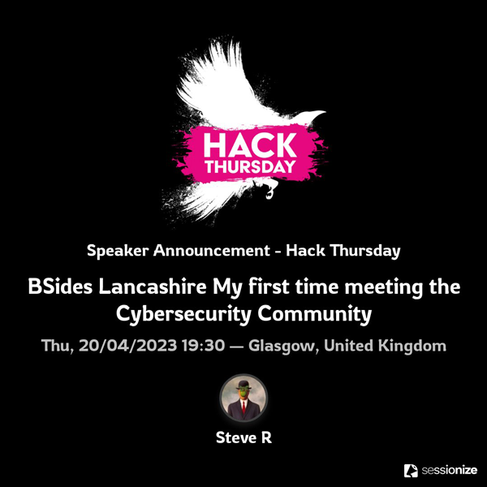

# Organisation and planning

Generally speaking, planning and executing a traditional conference will follow the following pattern:

* Concept stage
* Support stage
* Promotion stage
* Building stage
* Conference stage
* Post conference stage

You should have clearly defined goals that you want to achieve at the end of each stage, and sometimes these stages may overlap, or repeat themselves.

Things will change, go wrong, or not quite stick to the original plan and that's **absolutely fine**. Understanding that things might go wrong, planning for those eventualities, and [having contingencies in place](#backups) can massively help to keep the event running smoothly.

When choosing your date, remember to check holiday schedules such as half terms / school holidays and be mindful that different districts have different half terms. You can use [infosecmap.com](https://infosecmap.com/) to check other conferences scheduled around your potential chosen date.

## Accounting

An accounting tool to keep track of money and invoices is a good investment. If you're comfortable doing everything in spreadsheets and word documents, that's absolutely fine - but having a tool or system that automatically generates invoices, calculates due dates for payment, keeps track of expendature, and sends automatic chasers for late payers can be a massive benefit.

Regardless of whether you end up using a dedicated tool, spreadsheet system, or good old fashioned paper based accounting - it is really important to ensure all members of your committee/organisation team can see the health of the bank balance, invoices sent (and their status), and any expected costs.

## Advisors 

Having a friendly face that's done it all before can massively reduce the pressure of running an event. Their guidance, and experience, can help with many of the common issues that may crop up. Other conference organisers are often incredibly happy to assisting others run a successful event, provided you aren't trying to run one in competition with them ;).

## After party

Many conferences now offer an official after party. Often a [sponsor](#sponsors) slot will be dedicated to purely sponsoring the after party activities, food, or bar tab.

If you're offering a free bar tab, or drinks/food tokens, this needs to be managed carefully especially if the after party is hosted in an area where members of the public may roam in. Wrist bands, physical tokens, or even conference badges can be used as a validation method that the person asking for a free round of drinks was a genuine attendee.

Considerations should be given towards attendees around the theme of the after party. For example: if the after party is a BBQ event, that might not cater for vegans/vegetarians. Similarly, if the after party is solely based around free alcoholic drinks, attendees may be non-drinkers.

Care should be taken to avoid [dilution](types_of_conference.md#in-person) of attendees between the conference venue and the after party venue (if the two are seperate).

## AV & tech

Decide early about whether you want the talks recorded and shared online. Even if you choose not to record or stream talks, you'll need to consider projectors, screens, backup laptops, as well as the myriad of cables to connect devices to the projector (because not everyone has HDMI anymore).

Having a bag of cables, clickers, dongles, usb sticks, batteries, and testing the equipment *before* the conference is highly recommended.

> An "MVP" track pack would be a projector, an HDMI cable, USB memory stick, USB clicker, a power extension lead, and a laptop capable of outputting HDMI and accepting both a USB memory stick and clicker at the same time.

When it comes to recording/streaming talks on the day, infosec conferences benefit from having the wonderful [Cooper](https://twitter.com/Ministraitor) – and his rigs – on hand to help at most conferences. If you're planning on using his rigs, or calling in his services, please [donate a mate](https://administraitor.video/buy_me_a_mate.html) or send him some sort of thank you. You can find his [full (and incredibly modest) terms](https://administraitor.video/organizers/requirements.html) on his website, [administraitor.video](https://administraitor.video). Simply put the man is a legend and donates a ridiculous amount of his time, experience, knowledge, and patience, helping film infosec conferences around the world.

## Backups

Speakers can drop out for a variety of reasons – both in person and virtual – so planning for an eventuality where one, or more, speakers drop out is a very worthwhile endeavour. Having reserve talks (with speakers), a panel, mini-workshop, or fun item that can be dropped in to the schedule at the last minute.

Similar to speakers, there's a possibility an organiser or volunteer may drop out on the day. You should aim to build resilience into your conference so that, if an organiser or volunteer were to drop out, their responsibilities can either be spread among the remaining volunteers or reserve volunteers can be called upon on the day.

Having a shared document repository or password manager can help ensure that the event will continue regardless of what challenges it faces.

[As the big man once said](https://www.youtube.com/watch?v=t99KH0TR-J4), the show must go on.

## Branding

While branding may be considered a "nice to have" element of the conference, it can make a huge impact to many aspects you might not have considered. Similarly, sponsors may be put off giving money (or haggling down the amounts) if the conference looks a bit "too cheap" or that you haven't given any care in its' presentation.

Social media promo images, [speaker cards](#speaker-cards), schedule books, and even slide templates (for opening & closing remarks) can make such a difference to the overall feel of the conference if planned for in advance. PSD and AI templates are freely available online for various social networks to ensure sizing is correct for each platform.

Creating header banner images that organisers, volunteers, speakers, and attendees can add to their social media profile can increase publicity around your conference. 

Deciding upfront what hashtags to use on social media can avoid unfortunate incidents (see #susanalbumparty), or dilution of PR on social media between things like #myCon24, #myCon2024, #myconference2024 etc.

Using templates provided by online tools, such as [Canva](https://canva.com), can help make this process much easier.

### OBS overlays

OBS ([Open Broadcaster Software](https://obsproject.com/)) is a popular tool of choice for streaming and recording events. Due to its popularity, it's often the tool of choice at many conferences. OBS has a high level of customisation for your stream or recording, meaning that you can take many feeds from different sources (such as webcams, presentations, microphones, and more), and combine them together into one single output.

If you're not using [Cooper's rigs](#av--tech), you'll need to figure out how best to broadcast any in-person or remote speaker you have. Obviously you can stream parts of the conference without having fancy stuff like OBS overlays, but it can make a huge difference to the overall look and feel of your conference.

### Speaker cards

Speaker cards can drive interest in the event as they normally are shared by the speaker, and sometimes the company they work for, on social media. Taking time to design a speaker card that fits with the conference theme can be very worthwhile and make your event stand out.

Care should be taken to ensure speaker, or sponsor, cards don't "wash out" sponsor logos or speaker pictures. Sponsors can often be **very** protective of their brand and how it's presented, hence always check their brand guidelines, if they're available.

**Examples of speaker cards:**

### Videos

Although rare to see as they require a higher effort on production, intro and promo videos can help give your conference an extra flair.

**Example videos:**

BeerCon2 intro video

BeerCon3 promo video

BeerCon3 intro video

## Broadcast

Broadcasting your conference online can make your event accessible to attendees that can't physically make your conference. A stable internet connection and a dedicated broadcast machine, with sufficient performance, is required to make this as solid as possible.

It's encouraged to read the full [broadcasting guide](broadcast.md) and tailor it to your conference (whether [in-person](types_of_conference.md#in-person), [virtual](types_of_conference.md#virtual), or [hybrid](types_of_conference.md#hybrid)).

## Budgeting

Understand exactly how much it'll cost to deliver a Minimum Viable Product (MVP) version of your conference and add on the additional "nice to have" bits later. Looking at other conferences' [sponsor packs](guides/sponsors.md) can be a good reference point to understand what level of funding is required.

Many sponsors will require an invoice to be sent to them and will pay within their own payment terms despite whatever due date is on the invoice. This can be immediate, 14/30/60/90 days after invoice submission, randomly without notice, or even after the conference has run. Planning your budgets in accordance with when money is due is very recommended and while it may be tempting to stick things on a credit card in the interim, care should be taken to ensure the sponsors will pay on the time you think. It's not uncommon for organisers to be out of pocket or have additional fees they weren't initially expecting at the end of a conference.

Be aware that accepting credit card payments, or selling tickets on platforms like Eventbrite can incur fees. These fees may be a small amount of money in the grand scheme of things but not accounting for a small percentage being taken from each ticket sale can have a knock on effect on budgets.

Having [money left over](post_conference.md#money) in the [bank account](#legality) after a conference is an ideal situation to be in – especially if there's plans to re-run the conference at a future date (or help out another conference).

## Call for papers (CFP)

Putting out a call for papers (or call for presentations), commonly called CFP, as early as possible can maximise the quality submissions you will receive.

Using platforms like [papercall.io](https://papercall.io), [sessionize](https://sessionize.com/), or even a simple [Google form](https://docs.google.com/forms) can make the CFP submission and sift process far easier to manage.

Making it clear what format the CFP takes (whether it's fully open, semi-anonymised, or fully anonymised) allows speakers to know where they stand upon submission.

In a **fully open** CFP process, no speaker information is redacted from a submission and speakers are aware of who is making the call on whether to accept their talk or not.

In a **semi-anonymised** CFP process identifiable speaker information, review board comments, or the identity of the CFP review board can be redacted during the sift phase. Semi-anonymous reviews can be useful to avoid bias - or the perception of bias - between speakers and the review board themselves.

In a **fully anonymised** CFP process, identifiable speaker information, review board comments, and the CFP review board themselves are completely anonymous. This anonymity avoids any bias, either perceived or actual, in selection or between the review board. It's not uncommon for fully anonymous CFP processes to remain sealed long after the conference has passed.

### Attracting submissions

Arguably the most nervewracking part of putting together a conference is the submission stage of the CFP. Reach out to as many organisations and groups as you can to publicise the CFP. While [sponsorship](#sponsors) of a conference shouldn't necessarily guarantee a speaking slot, encouraging sponsors to ask their staff to submit to the CFP process is a worthwhile option.

Some people may be nervous about applying and feel the need for [mentorship](#speaker-mentorship), regardless if they're a first time speaker or not. It's worth highlighting on the CFP if you intend to provide [mentorship](#speaker-mentorship), should the speaker choose it.

### Sift

Sifting through CFPs can feel like a daunting task, especially if you've received a large number. It's highly recommended to have a cohort of people to review talks to avoid any bias and have a scoring system in place to rank various talks based on general fit, theme, topic, etc. This cohort doesn't even need to be just organisers, or volunteers - many conferences benefit from a vast review team adding comments and giving their thoughts and opinions.

### Accepting and rejecting

Once you've got a good idea of who you'd like to offer a speaking (or workshop) slot to, getting the acceptance emails out early with a deadline is highly recommended. This allows you to ensure the schedule is as solid as it can be, as early as possible.

Rejecting speakers can be one of the hardest parts of the entire CFP process but a necissary one. Giving speakers constructive feedback as to why they weren't successful is always recommended.

## Code of conduct

Having a code of conduct for your conference allows speakers, sponsors, attendees, and volunteers to feel safe and welcome. You can use a well known, widely used, code of conduct such as the [Berlin code of conduct](https://berlincodeofconduct.org/) or design your own if you wish.

## Controversy

While the vast majority of conferences go ahead without a single hitch, you should be mindful of who's involved, or attending, your conference and if there may be any negativity directed towards crew, speakers, [sponsors](#sponsors), the venue, or indeed other attendees. You should also take into consideration if sponsors are particularly controversial either in general, or region specific, and having a plan to mitigate any issues that may arise.

Potential controversy, or the assumption of such, can often be completely avoided by a having a good, coherent, [code of conduct](#code-of-conduct) in place beforehand.

> Whoever said "there's no such thing as bad publicity" was full of shit. Bad PR might not hurt your conference (it may even positively impact it) but it _can_ take a toll on organisers, speakers, volunteers, and even attendees. It can be tempting to be edgy and controversial as a conference but one small mistake may taint the memory of the entire conference.

## Comms strategy

Having an effective communication strategy is important. Speakers, attendees, sponsors, and even volunteers like to be kept in the loop at every stage of the plan. Having regular check-ins with speakers, volunteers, and sponsors before the event helps to avoid no-shows on the day, and repeated questions being asked.

Having a platform, such as discord or slack, to communicate with everyone before, during, and after the conference can be very beneficial for nurturing discussions, planning future conferences, and inspire a bit of community spirit. Check the [virtual community section](virtual_community.md) for more indepth information.

During the conference period, it's worth setting up either a private channel in something like Discord, or using a messaging tool like Whatsapp, Signal, etc, to communicate with volunteers quickly on the day.

## Capture the flag (CTF)

Most infosec conferences run a Capture The Flag (CTF) style event in parallel to their main event.

Physical CTFs (such as scavenger hunts) that require people to run around the venue can bring a level of disruption you, or your speakers, may not be prepared for.

If you are running a parallel CTF that requires internet access of some sort, you should consider providing free conference WiFi, a dedicated room for CTFers to hang out, a CTF lead at the conference on the day, and checking 3G/4G/5G reception around the [venue](venue.md).

## Food

Providing food for everyone onsite can be challenging with different preferences (vegetarian/vegan for example), allergies, intolerances, and more. If your [venue](venue.md) is lucky enough to be situated near food and drink offerings, it may be wiser to allow people to sort themselves out (although be mindful of [dilution](types_of_conference.md#in-person)). Be mindful of anyone potentially fasting due to Ramadan, for example. If you are having an [after party](#after-party) it's a good idea to select a venue that also provides food to ensure everyone gets the option of eating.

Many venues, such as Universities, have their own catering or some even have their own rules surrounding external caterers (i.e. an uplift cost per head to bring your own food). It's recommended to have a chat with your venue to understand what can, and can't happen.

> Note: If you pencil in a coffee break on the schedule, make sure there's **actually** tea and coffee on site.

## Green room

Having a dedicated room [on site](venue.md) where speakers can dump their bags, rehearse their talk, and chat with volunteers is recommended. Supplying the green room with water, caffiene, and biscuits or similar is recommended to ease any nerves of speakers – speakers can often forget to eat or drink before their slot. Ensuring they have had some coffee, a biscuit, or even a glass of water before taking to the stage to present can avoid any fainting episodes.

Virtual only conferences benefit from the simplicity of creating a green room/private area for speakers to interact with organisers, volunteers, and other speakers. Although simple, it's recommended not to forget this step as speakers may have technical questions they'd rather not ask in front of attendees.

## Health and safety

If you plan to run an in-person event, it may be a requirement of the venue to supply your own first aiders on-site. Similarly, venues may require conference organisers to have suitable [liability insurance](##legality), or risk assessments in place for the event – especially for some of the weirder [villages](tracks_workshops_villages.md#villages).

## Keynotes

Having a keynote (or multiple) planned early can help structure the overall theme of your conference and shape, or even boost, the talk or workshop submissions. Keynotes should set the tone of the day and, hopefully, inspire your attendees. Keynote speakers don't need to be "huge names" but someone capable of presenting something thought provoking is recommended.

## Legality

> It should be noted that this document does not constitute as legal advice, always consult with a legal professional and/or accountant before undertaking any legal partnership or liability.

It's worth considering getting your conference set up as a legal entity (Ltd company, CIC, or similar). This can protect you as an organiser from liability, should it arise, but also give sponsors a legal entity to pay sponsorship fees to.

Having a dedicated bank account keeps any funds seperate from organisers' personal accounts. Bank accounts can be a bit of a pain to set up for community groups so it's worth getting this registered as soon as possible to avoid sponsorship payment delays.

## Location

During the COVID-19 pandemic, attending and organising remote conferences became the norm for many of us. Recently things have gone back to normality a bit with in-person being the preferred option however fully virtual conferences still exist and can be successful.

Virtual only conferences are slightly easier logistically but can bring additional challenges an in-person only conference doesn't have such as license costs for software, streaming ability, wifi connectivity, etc.

It's possible to do a conference as a "hybrid" event, allowing virtual attendees to stream or watch.

## Logistics

Quiet rooms, prayer rooms, green rooms, and similar might seem like a "nice to have" - and while not every conference venue will be equiped to handle so many additional rooms - they can go a long way toward incusivity at your event.

Many events are held within modern venues where modern facilities are available for all to use, but some are held in older buildings where these facilities are not available easily. In these cases, for example a prayer room, it's worth seeking out the nearest area that can be used in order to make your speakers, sponsors, or even attendees feel welcome and included.

On a similar note, understanding [accessibility](venue.md#accessibility) for your conference, pre-conference, and [after party](#after-party) can ensure that nobody has to be turned away due to the [venue](venue.md) not being fully [accessible](venue.md#accessibility).

> Note: Many attendees who need accessible facilities won't be angry at not having a prayer room, blue badge parking zones, or accessible entrances if you've done your best to accommodate and consider these accessibile requirements.

## Publicity

Scheduling regular posts on social media platforms to publicise the calls for [volunteers](#volunteers), [sponsors](#sponsors), [speakers](#call-for-papers-cfp) is a good idea to maximise publicity for your conference.

Having automated posts scheduled during the conference for each speaker on, or around, their speaking slot may seem like a good idea but schedules can be fluid and speakers can [drop out](#backups) on the day. Having a posts drafted and a dedicated volunteer to push them out just before and during the talks are a good alternative and can save conflicting information going out on social media.

> Note: if scheduling posts, it's highly recommended that all posts are scheduled in UTC to avoid any issues with clocks changing.

Getting the CFP sorted quickly allows you to advertise the schedule well in advance too - meaning people can pick out talks they'd like to attend and start chattering on social media. Scheduling speakers in your day is an artform.

## Recordings

Some speakers don't want to be recorded, and that's absolutely fine. You do, however, owe it to those that do want it recorded to provide them with an artefact worthy of going on a CV. Work with the AV team to ensure your vision of the end product matches what they produce.

Things can fail, and this should be planned for. Have a backup plan (such as ensuring audio and video of speakers is always recorded but slides can be ditched) for eventualities whereby technology fals on the day. Remember - you can always ask a speaker to send their slides later and splice that into the recording, you can't ask them to regurgitate a funny anecdote based off of a situation that happened on the day with the same humour and charisma that was shown on stage.

Have [a good action plan](post_conference.md#recordings) for editing, uploading, reviewing, and releasing recordings in advance (and share this with speakers and attendees) to avoid continual questions around when the recordings may be released.

## Remote speakers

If you are considering welcoming [remote speakers](types_of_speaker.md#remote) to "dial in" to the conference and present remotely, contingencies should be in place for situations such as internet connectivity issues and timezones should be taken into account especially when dealing with speakers from a different timezone to the conference itself. 

## Scheduling

Scheduling talks on the day can be one of the trickiest parts of running a conference. Schedules should be easily accessible, legible, updatable, and released as early as possible to allow attendees (and other speakers) plenty of time to decide which talks to go to and figure out logistics of getting from one track to another.

Building in buffer time (~5 minutes) between talks is useful to allow people moving between talks but also for situations where talks run over slightly. Stacking long talks together, without a break or buffer between them, may lead to attendees dropping out or becoming restless.

## Speaker mentorship

If you are running a first time speaker track, or indeed a first time speaker conference, it may be worth approaching mentors that can help guide the speakers, answer questions, and finesse their talks. Ideally the mentors should be people that have spoken before and understand how to structure a talk.

## Sponsors

Having an idea of the types of sponsors you want to invite ahead of time can give you a massive leg up. Sponsors often wont want to share a headline spot with a competitor, or be stationed next to them in the vendor area. Deciding early what benefits sponsors will receive and outlining which ones you plan to target. It's advisable to target companies that have previously sponsored similar conferences or those you, or your team, already have a relationship with.

It's worth considering opening up sponsorship to smaller start-ups and community sponsorships at a reduced rate. While a smaller figure per sponsor may feel like a waste of time initially, it can be surprising (and heartwarming) when many community members club together to sponsor your event.

## Swag

Many conferences give swag to attendees and speakers.

As a speaker or attendee, swag is nice to receive but it shouldn't be something that is expected. Budgets can be limited, and size based swag (like t-shirts) can be a nightmare to accurately predict. Swag should be seen as a "nice to have" rather than a "must have" using the leftover budget from the sponsors. There's a sustainability aspect to swag to consider, is it a t-shirt that will fade after a couple of washes, or a gimmick which is discarded or broken a week later?

## Task management

Having a way to list, assign, discuss, and categorise tasks is recommended. It doesn’t need to be a super complicated, automated, system but having something all members of your organising team can easily keep on top of their tasks helps the conference stay on track, and ensures nothing is forgotten about.

## Team

Having a team behind you during the entire event is thoroughly recommended. Everyone brings different skillsets, opinions, and ideas to the table. It may seem, at the first stage, that running a conference is easy but there's a lot of factors that can be a massive time and energy drain which has a knock on effect on the entire conference. Sharing the load between organisers can help lessen the burden on yourself and allow you to enjoy the experience.

Delegate, delegate, delegate.

## Ticketing

While ticketing your event isn't a necessity, it can help you and your team understand how many people are likely to show up on the day. If you are running an in-person event, the venue may have a maximum occupancy that you can't exceed. Also, having the ticket statistics of previous events helps plan for and market any future events.

If your event is running as a purely free (or a pay what you want) event, be aware that these types of conferences tend to have a higher no-show rate than paid-for ticketed events.

If you're charging for tickets be aware of any fees ticketing platforms (Eventbrite, tito, etc) charge, and factor that into your [budgeting](#budgeting). A small number of conferences offer "pay it forward" community ticket types - this allows people with slightly more budget sponsor a free ticket for a student, or similar.

Speakers and volunteers should always be given a free ticket to the event. Sponsors/vendors exhibiting on the day should be granted free entry and are sometimes offered a small batch of additional tickets as part of their [sponsorship](#sponsors) offering. This is not mandatory though.

## Timescales

Giving speakers at least a month (ideally more) notice that they've been selected, rejected, or are in "reserve" allows you to solidify your schedule and publicise who's speaking at your event. It allows attendees, and speakers themselves, to decide if they want to attend your conference. It's rare that a speaker submits a talk proposal and backs out, but it does happen. Don't assume your speakers are local – some may have to travel quite far to speak at your conference so giving them as much time as you possibly can to organise transport, book accommodation, and perhaps even annual leave is a very good idea. Similarly, with volunteers – letting them know they're expected to help on the day can give them time to ask questions or even back out themselves.

Having clear defined schedules of when certain parts need to be solidified (such as venue, sponsorship collection, swag purchase, speaker comms, or [recording drop](post_conference.md#recordings)) can reduce the stress levels of the entire conference.

## Tracks

Deciding how many [tracks, workshops, and villages](tracks_workshops_villages.md) you want to run during your conference. Remember - the more tracks, the more complexity is involved in planning, management, and running each one.

## Volunteers

Putting a call for volunteers out early is incredibly important. Volunteers can have vastly different skillsets meaning some are far more comfortable being front of house "MC's" while others prefer some behind the scenes roles. Understanding the strengths and weaknesses of your volunteer team is vital to keep the conference running smoothly. Consider asking prospective volunteers if they volunteer at other events, or what particular skills they have so you can adjust accordingly.

Having a predefined list, before the conference, of volunteer roles helps, as does having a Lead volunteer who can coordinate others. Although not always possible, organisers should try not to have an assigned role, allowing them to firefight on the day if needed.

For more information, check the [volunteer management](volunteer_management.md) page.
